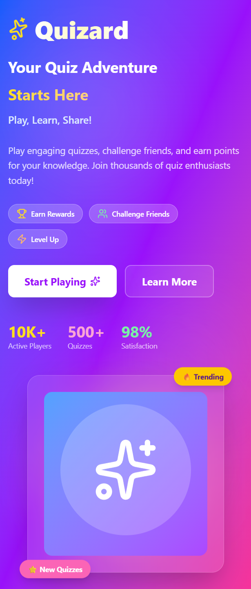

# 🎯 QuizeTaskMaster

A comprehensive task management and quiz application that combines productivity with learning. Built with modern web technologies to help users manage tasks efficiently while engaging with interactive quizzes.



## ✨ Features

### Task Management
- ✅ **Create & Organize Tasks** - Add, edit, and delete tasks with ease
- 📋 **Task Categories** - Organize tasks by categories or projects
- ⏰ **Deadlines & Reminders** - Set due dates and get notifications
- 🎨 **Priority Levels** - Mark tasks as high, medium, or low priority
- 📊 **Progress Tracking** - Monitor completion status and productivity

### Quiz System
- 🧠 **Interactive Quizzes** - Engaging quiz interface with multiple question types
- 📝 **Multiple Categories** - Quizzes across various topics and subjects
- ⏱️ **Timed Challenges** - Optional time limits for competitive learning
- 🏆 **Score Tracking** - Track your performance and progress
- 💡 **Instant Feedback** - Get immediate results and explanations

### General Features
- 📱 **Fully Responsive** - Works seamlessly on all devices
- 💾 **Local Storage** - Save your data locally in the browser
- 🎭 **Smooth Animations** - Beautiful transitions and interactions
- ⚡ **Fast & Lightweight** - Optimized for performance

## 🚀 Technologies Used

- **React** - Modern UI library for building interactive interfaces
- **JavaScript (ES6+)** - Core programming language
- **CSS3** - Styling and animations
- **Bootstrap / Tailwind CSS** - Responsive design framework
- **React Router** - Navigation and routing
- **LocalStorage API** - Data persistence

## 📦 Installation

1. **Clone the repository**
   ```bash
   git clone https://github.com/Premkumar-collab/quizeTaskMaster.git
   ```

2. **Navigate to project directory**
   ```bash
   cd quizeTaskMaster
   ```

3. **Install dependencies**
   ```bash
   npm install
   ```

4. **Start the development server**
   ```bash
   npm start
   ```

5. **Open your browser**
   ```
   Navigate to http://localhost:3000
   ```

## 🛠️ Build for Production

Create an optimized production build:

```bash
npm run build
```

The build folder will contain the optimized files ready for deployment.

## 📁 Project Structure

```
quizeTaskMaster/
├── public/
│   ├── index.html
│   └── favicon.ico
├── src/
│   ├── components/
│   │   ├── Tasks/
│   │   │   ├── TaskList.js
│   │   │   ├── TaskItem.js
│   │   │   └── AddTask.js
│   │   ├── Quiz/
│   │   │   ├── QuizCard.js
│   │   │   ├── Question.js
│   │   │   └── Results.js
│   │   ├── Layout/
│   │   │   ├── Header.js
│   │   │   ├── Sidebar.js
│   │   │   └── Footer.js
│   │   └── Common/
│   ├── pages/
│   │   ├── Home.js
│   │   ├── Tasks.js
│   │   ├── Quiz.js
│   │   └── Dashboard.js
│   ├── context/
│   │   ├── TaskContext.js
│   │   └── QuizContext.js
│   ├── utils/
│   │   ├── localStorage.js
│   │   └── helpers.js
│   ├── styles/
│   │   └── App.css
│   ├── App.js
│   └── index.js
├── package.json
└── README.md
```

## 🎯 Usage Guide

### Task Management

1. **Add a Task**
   - Click the "Add Task" button
   - Fill in task details (title, description, priority, due date)
   - Click "Save" to add to your task list

2. **Edit a Task**
   - Click the edit icon on any task
   - Modify the details
   - Save changes

3. **Complete a Task**
   - Click the checkbox to mark as complete
   - Completed tasks move to the "Completed" section

4. **Delete a Task**
   - Click the delete icon to remove a task

### Quiz Features

1. **Start a Quiz**
   - Select a quiz category from the dashboard
   - Choose difficulty level (if available)
   - Click "Start Quiz"

2. **Answer Questions**
   - Read each question carefully
   - Select your answer
   - Click "Next" to proceed

3. **View Results**
   - See your score and performance
   - Review correct and incorrect answers
   - Retake quiz or try a different category

## 🎨 Customization

### Add Your Own Quizzes

Edit the quiz data in `src/data/quizData.js`:

```javascript
export const quizzes = [
  {
    id: 1,
    category: "JavaScript",
    questions: [
      {
        question: "What is closure in JavaScript?",
        options: ["A", "B", "C", "D"],
        correctAnswer: 0,
        explanation: "..."
      }
    ]
  }
];
```

### Modify Task Categories

Update categories in `src/utils/constants.js`:

```javascript
export const TASK_CATEGORIES = [
  "Personal",
  "Work",
  "Study",
  "Health",
  "Shopping"
];
```

### Change Theme Colors

Update color variables in `src/styles/App.css`:

```css
:root {
  --primary-color: #3f396d;
  --secondary-color: #6c63ff;
  --accent-color: #ff6584;
  --background-color: #f8f9fa;
}
```

## 🌐 Deployment

### Deploy to Vercel

1. Install Vercel CLI:
   ```bash
   npm install -g vercel
   ```

2. Deploy:
   ```bash
   vercel
   ```

### Deploy to Netlify

1. Build the project:
   ```bash
   npm run build
   ```

2. Drag and drop the `build` folder to [Netlify](https://app.netlify.com/)

### Deploy to GitHub Pages

1. Install gh-pages:
   ```bash
   npm install --save-dev gh-pages
   ```

2. Add to `package.json`:
   ```json
   "homepage": "https://Premkumar-collab.github.io/quizeTaskMaster",
   "scripts": {
     "predeploy": "npm run build",
     "deploy": "gh-pages -d build"
   }
   ```

3. Deploy:
   ```bash
   npm run deploy
   ```

## 🔮 Future Enhancements

- [ ] User authentication and cloud sync
- [ ] Collaborative task sharing
- [ ] More quiz categories and questions
- [ ] Export tasks to CSV/PDF
- [ ] Mobile app version
- [ ] Task analytics and insights
- [ ] Leaderboard for quiz competitions
- [ ] Voice commands for task creation

## 🐛 Known Issues

- None at the moment. Please report any bugs in the Issues section.

## 📝 License

This project is open source and available under the [MIT License](LICENSE).

## 👤 Author

**Premkumar**

- GitHub: [@Premkumar-collab](https://github.com/Premkumar-collab)
- Portfolio: [Your Portfolio Link]
- LinkedIn: [Your LinkedIn Profile]

## 🤝 Contributing

Contributions, issues, and feature requests are welcome!

1. Fork the project
2. Create your feature branch (`git checkout -b feature/AmazingFeature`)
3. Commit your changes (`git commit -m 'Add some AmazingFeature'`)
4. Push to the branch (`git push origin feature/AmazingFeature`)
5. Open a Pull Request

## 💡 Inspiration

This project combines the best of task management and educational quizzes to create a productive learning environment. Perfect for students, professionals, and anyone looking to stay organized while expanding their knowledge.

## ⭐ Show Your Support

Give a ⭐️ if you find this project useful!

## 📞 Contact

Have questions or suggestions? Feel free to reach out:

- Email: codewithredz@gmail.com


## 🙏 Acknowledgments

- Thanks to all contributors who helped build this project
- Inspired by productivity apps and educational platforms
- Built with passion for learning and productivity

---

**Made with ❤️ by Premkumar** | Combining Productivity with Learning 🎯📚
